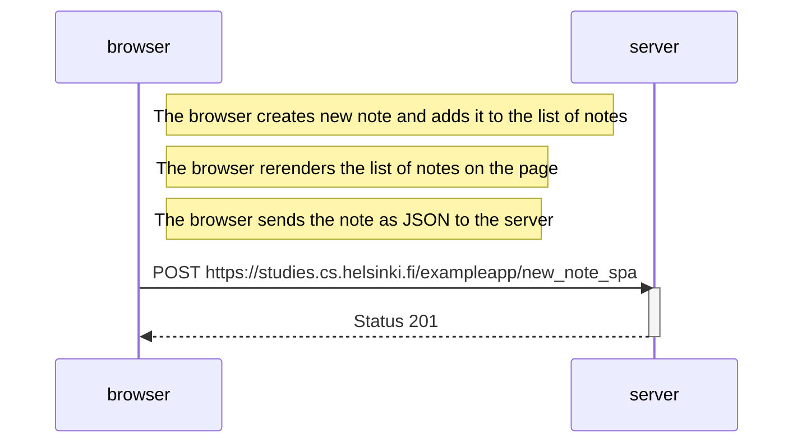

```mermaid
sequenceDiagram
    participant browser
    participant server

    Note right of browser: The browser creates new note and adds it to the list of notes
    Note right of browser: The browser rerenders the list of notes on the page
    Note right of browser: The browser sends the note as JSON to the server
    browser->>server: POST https://studies.cs.helsinki.fi/exampleapp/new_note_spa
    activate server
    server-->>browser: Status 201
    deactivate server

```
